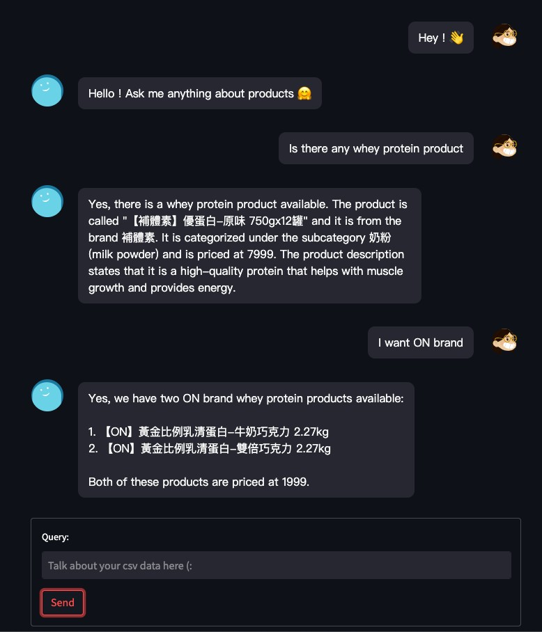
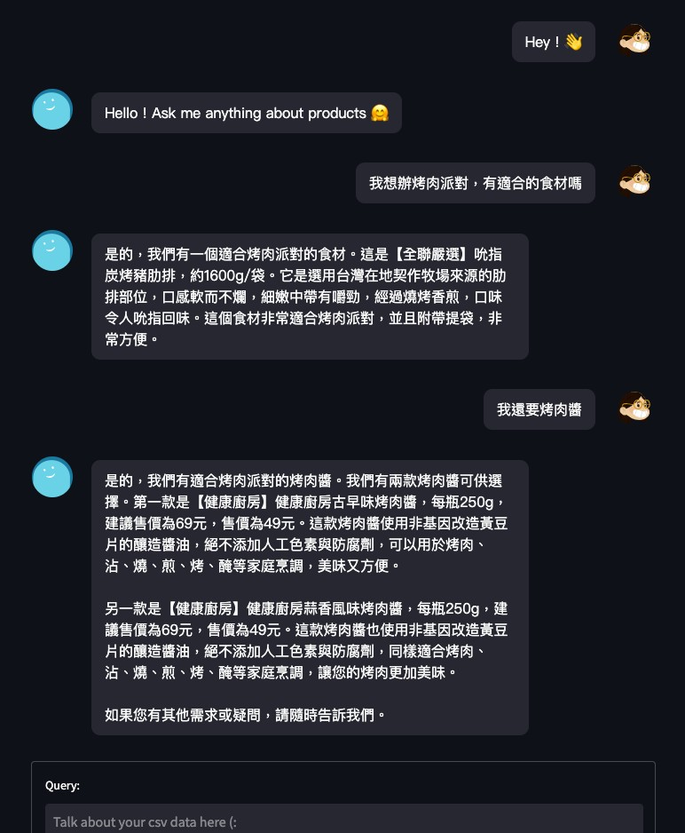

# E-commerce Chatbot

This is the tiny project that constructs the chatbot using by langchain and streamlit.

## Data

The data comes from a small part of pxmart 隔日達 https://pxbox.es.pxmart.com.tw/ and put in `data/` folder.

## Setup

Python version 3.9.13

Install the package 

```bash
pip install -r requirements.txt
```

You need to create `.env` in the root.

The `.env` should be like

```bash
OPENAI_API_KEY = <your token>
HUGGINGFACEHUB_API_TOKEN = <your token>
```

## Start up

Start backend (fastapi and langchain)

```bash
python app.py
```

Srart frontend (streamlit)

```bash
streamlit run frontend.py
```

## Demo

We can use English to ask questions to chatbot althought the dataset is Chinese.




Another demo screenshot that shows I want to throw a barbecue party and ask the chatbot for the right ingredients.


